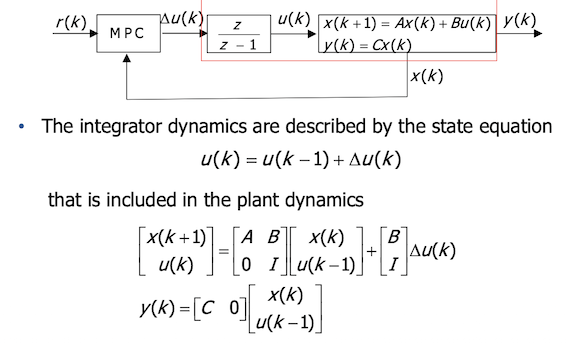

# Model Predictive Control
Clearly, the greater is $H_p$ the more degrees of freedom are in the optimization. However, the problem of complexity increase.  
### What are the possible solutions?
One possible solution is to "see more than what we optimize". What does it mean? We predict system behaviour over the finite horizon $H_p$, but we optimize only the first
$H_c \leq H_p$ steps. The remaining control values can be set in different ways.  
Another possibility is _variable blocking_: control moves are grouped so that their value is "blocked" for 2 or more prediction steps.  
Last one is useful is we have system delays or "inverse response". In this case, instead of optimize every states, we focus on the states only after the delay or the inverse response.  

## Output tracking
We can include output tracking, by adding in the cost function a quadratic term of the form  

$$
(y(k+i \mid k)-r(i))^T \ Q_y \ (y(k+i \mid k) - r(i))
$$

we can also include output constraints. These constraints are translated in linear inequalities of $U(k)$. 

As we saw for LQR, with an integration action we increase tracking performance. This time, we can easily take it into account by using the input increment 

$$
\Delta u(k) = u(k) - u(k-1)
$$

In fact, in z domain, we have

$$
U(z) = \frac{z}{z-1}\Delta U(z)
$$

and this is a discrete time integrator! The final system, with matrix model, optimization problem and constraints are shown below:

  

## MPCtools
see live script on exercise folder